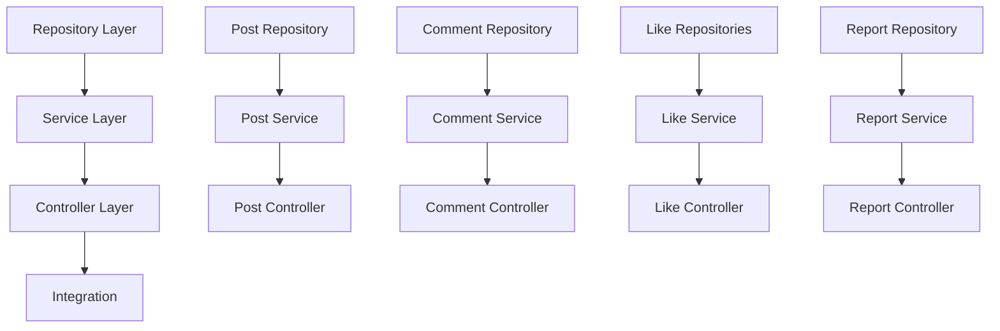

# Community Service Implementation Workflow

## 🎯 Project Overview
Implementation of community service with posts, comments, replies, likes, and reporting functionality for AIVA backend.

## 📊 Architecture Analysis

### Current State
- ✅ Complete entity models (6 entities)
- ✅ Database configuration (MySQL + Redis)
- ✅ Spring Boot setup with JPA auditing
- ❌ Empty service/controller/repository layers

### Target Architecture
```
┌─ Controller Layer ─────────────────────────┐
│  CommunityPostController                   │
│  CommentController                         │  
│  LikeController                            │
│  ReportController                          │
└────────────────────────────────────────────┘
         │
┌─ Service Layer ────────────────────────────┐
│  CommunityPostService                      │
│  CommentService                            │
│  LikeService                               │
│  ReportService                             │
└────────────────────────────────────────────┘
         │
┌─ Repository Layer ─────────────────────────┐
│  CommunityPostRepository                   │
│  CommentRepository                         │
│  CommunityLikeRepository                   │
│  CommentLikeRepository                     │
│  ReportRepository                          │
└────────────────────────────────────────────┘
```

## 🚀 Implementation Phases

### Phase 1: Repository Layer (Foundation)
**Duration**: 2-3 days | **Priority**: Critical

#### 1.1 Core Repositories
- [ ] **CommunityPostRepository**
  - Basic CRUD operations
  - `findByUserId(UUID userId, Pageable pageable)`
  - `findByDeletedAtIsNull(Pageable pageable)` - Active posts feed
  - `findByUserIdAndDeletedAtIsNull(UUID userId, Pageable pageable)`

- [ ] **CommentRepository** 
  - Basic CRUD operations
  - `findByPostIdAndDeletedAtIsNull(UUID postId, Pageable pageable)`
  - `findByPostIdAndParentCommentIdIsNullAndDeletedAtIsNull(UUID postId)` - Top-level comments
  - `findByParentCommentIdAndDeletedAtIsNull(UUID parentId)` - Replies

- [ ] **CommunityLikeRepository**
  - `findByPostIdAndUserId(UUID postId, UUID userId)` - Check like status
  - `deleteByPostIdAndUserId(UUID postId, UUID userId)` - Unlike
  - `countByPostId(UUID postId)` - Like count

- [ ] **CommentLikeRepository**
  - `findByCommentIdAndUserId(UUID commentId, UUID userId)`
  - `deleteByCommentIdAndUserId(UUID commentId, UUID userId)`
  - `countByCommentId(UUID commentId)`

- [ ] **ReportRepository**
  - `findByReporterUserIdAndTargetTypeAndTargetId()` - Duplicate check
  - `countByTargetTypeAndTargetId()` - Report count

#### 1.2 Database Migrations
- [ ] Create Flyway migration scripts
- [ ] Add performance indexes
  ```sql
  CREATE INDEX idx_posts_user_created ON community_posts(user_id, created_at DESC);
  CREATE INDEX idx_comments_post_parent ON comments(post_id, parent_comment_id);
  CREATE INDEX idx_likes_post_user ON community_likes(post_id, user_id);
  ```

### Phase 2: Service Layer (Business Logic)  
**Duration**: 3-4 days | **Priority**: Critical

#### 2.1 CommunityPostService
- [ ] **Post CRUD Operations**
  - `createPost(CreatePostRequest request, UUID userId)` 
  - `updatePost(UUID postId, UpdatePostRequest request, UUID userId)`
  - `deletePost(UUID postId, UUID userId)` - Soft delete
  - `getPost(UUID postId)` - With user info and like status

- [ ] **Feed Operations**
  - `getUserPosts(UUID userId, Pageable pageable)`
  - `getCommunityFeed(Pageable pageable)` - All active posts
  - `getPopularPosts(Pageable pageable)` - Sorted by engagement

#### 2.2 CommentService
- [ ] **Comment Operations**  
  - `createComment(CreateCommentRequest request, UUID userId)`
  - `createReply(CreateReplyRequest request, UUID userId)`
  - `updateComment(UUID commentId, UpdateCommentRequest request, UUID userId)`
  - `deleteComment(UUID commentId, UUID userId)` - Soft delete

- [ ] **Comment Retrieval**
  - `getPostComments(UUID postId, Pageable pageable)` - Hierarchical structure
  - `getCommentReplies(UUID commentId)` - Nested replies

#### 2.3 LikeService  
- [ ] **Like Operations**
  - `likePost(UUID postId, UUID userId)` - Idempotent
  - `unlikePost(UUID postId, UUID userId)`
  - `likeComment(UUID commentId, UUID userId)`
  - `unlikeComment(UUID commentId, UUID userId)`

- [ ] **Like Status**
  - `isPostLikedByUser(UUID postId, UUID userId)`
  - `isCommentLikedByUser(UUID commentId, UUID userId)`

#### 2.4 ReportService
- [ ] **Reporting Operations**
  - `reportPost(ReportRequest request, UUID reporterUserId)`
  - `reportComment(ReportRequest request, UUID reporterUserId)`
  - Duplicate report prevention
  - Notification to moderation system

### Phase 3: API Layer (Controllers & DTOs)
**Duration**: 2-3 days | **Priority**: Critical  

#### 3.1 Data Transfer Objects
- [ ] **Request DTOs**
  ```kotlin
  CreatePostRequest(content: String, images: List<String>?)
  UpdatePostRequest(content: String)
  CreateCommentRequest(postId: UUID, content: String)  
  CreateReplyRequest(postId: UUID, parentCommentId: UUID, content: String)
  UpdateCommentRequest(content: String)
  ReportRequest(targetType: ReportTargetType, targetId: UUID, reasonCode: String, details: String?)
  ```

- [ ] **Response DTOs**
  ```kotlin
  PostResponse(id, userId, userName, content, images, likeCount, commentCount, isLiked, createdAt)
  CommentResponse(id, postId, userId, userName, content, likeCount, isLiked, parentCommentId?, replies?, createdAt)
  LikeResponse(success: Boolean, newLikeCount: Int)
  ```

#### 3.2 REST Controllers
- [ ] **CommunityPostController**
  ```
  POST   /api/v1/posts                    - Create post
  GET    /api/v1/posts                    - Get community feed  
  GET    /api/v1/posts/{postId}          - Get specific post
  PUT    /api/v1/posts/{postId}          - Update post
  DELETE /api/v1/posts/{postId}          - Delete post
  GET    /api/v1/posts/users/{userId}    - Get user's posts
  ```

- [ ] **CommentController**
  ```
  POST   /api/v1/comments                 - Create comment
  POST   /api/v1/comments/{commentId}/replies - Create reply  
  GET    /api/v1/posts/{postId}/comments - Get post comments
  PUT    /api/v1/comments/{commentId}    - Update comment
  DELETE /api/v1/comments/{commentId}    - Delete comment
  ```

- [ ] **LikeController**
  ```
  POST   /api/v1/posts/{postId}/like     - Like/unlike post
  POST   /api/v1/comments/{commentId}/like - Like/unlike comment
  ```

- [ ] **ReportController**  
  ```
  POST   /api/v1/reports                 - Report content
  ```

### Phase 4: Integration & Enhancement
**Duration**: 2-3 days | **Priority**: Important

#### 4.1 Cross-Service Integration
- [ ] **User Service Client**
  - Fetch user information for posts/comments
  - Validate user existence
  - User profile integration

- [ ] **Notification Service Integration**
  - Notify on new comments/replies
  - Notify on likes
  - Notify on reports (to moderators)

#### 4.2 Performance & Security
- [ ] **Input Validation**
  - Content length limits (posts: 1000, comments: 300)
  - HTML sanitization
  - Image upload validation

- [ ] **Rate Limiting**
  - Post creation: 5 per hour per user
  - Like actions: 100 per hour per user  
  - Reports: 10 per day per user

- [ ] **Caching Strategy**
  - Redis cache for popular posts
  - Cache user information
  - Cache like counts for performance

- [ ] **Security**
  - Authorization checks (own content modification)
  - Content filtering
  - Spam prevention

## 🔧 Development Guidelines

### Code Standards
- Follow existing Kotlin/Spring Boot patterns
- Use UUID for all entity IDs
- Implement soft delete for user content
- Include proper error handling and logging

### Testing Strategy  
- Unit tests for service layer business logic
- Integration tests for repository layer
- API tests for controller endpoints
- Test data setup with proper cleanup

### Database Considerations
- Use transactions for operations affecting multiple entities
- Implement proper indexing for performance
- Consider read replicas for feed queries
- Plan for pagination from the start

## 📋 Task Dependencies



## 🚧 Risk Mitigation

### Technical Risks
- **Database Performance**: Implement proper indexing and pagination early
- **Concurrent Modifications**: Use optimistic locking for like counts
- **Memory Usage**: Limit result set sizes and implement streaming where needed

### Business Risks  
- **Content Moderation**: Implement basic content filtering and reporting
- **Spam Prevention**: Rate limiting and duplicate detection
- **User Experience**: Ensure fast response times with caching

## 📈 Success Metrics

### Functional Requirements
- [ ] Posts can be created, read, updated, deleted
- [ ] Comments and replies work hierarchically  
- [ ] Like/unlike functionality works for both posts and comments
- [ ] Report system captures inappropriate content
- [ ] All operations are properly authenticated and authorized

### Performance Requirements
- [ ] Feed loading < 500ms (95th percentile)
- [ ] Comment loading < 300ms  
- [ ] Like operations < 200ms
- [ ] Support 1000+ concurrent users

### Quality Requirements  
- [ ] 90%+ test coverage on service layer
- [ ] All APIs documented with OpenAPI/Swagger
- [ ] Proper error handling and logging
- [ ] Database migrations are reversible

## 🎛️ Configuration & Deployment

### Environment Variables
```yaml
# Database
DB_URL: jdbc:mysql://localhost:3308/aiva_community  
DB_USER: aiva
DB_PASS: aiva123

# Redis
REDIS_HOST: localhost
REDIS_PORT: 6379

# File Upload
UPLOAD_PATH: /tmp/aiva/uploads
MAX_FILE_SIZE: 10485760

# Rate Limiting
RATE_LIMIT_POST_CREATE: 5 per hour
RATE_LIMIT_LIKE_ACTION: 100 per hour
RATE_LIMIT_REPORT: 10 per day
```

### Service Dependencies
- MySQL 8.0+ (primary database)
- Redis (caching and session management)  
- User Service (user information)
- Notification Service (interaction notifications)

This workflow provides a systematic approach to implementing the complete community service functionality with proper separation of concerns, performance considerations, and quality assurance.